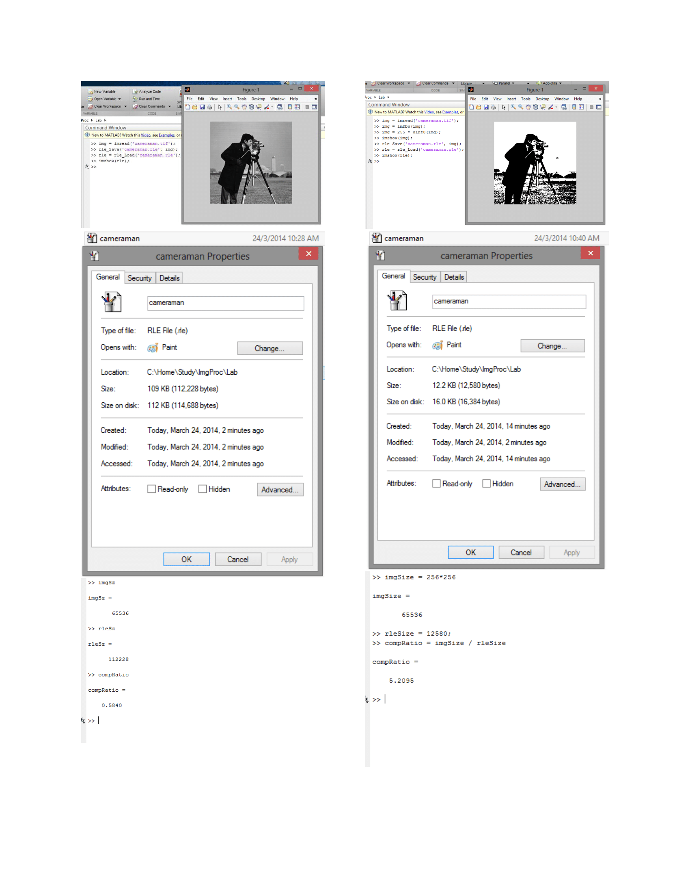

Run Length Encoding (RLE) is a compression scheme, where repeated values
are replaced with a pair of count and value.

**Course**: [Digital Image Processing Laboratory], Spring 2014 
**Taught by**: Prof. Lakshi Prosad Roy

[Digital Image Processing Laboratory]: https://github.com/nitrece/digital-image-processing-laboratory

 
 

 
